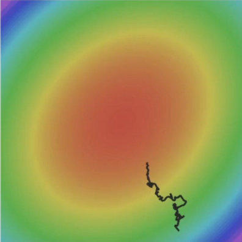
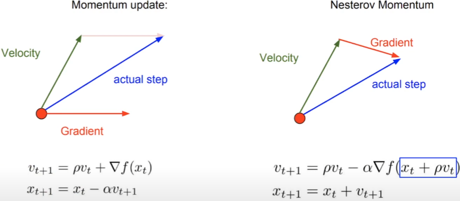
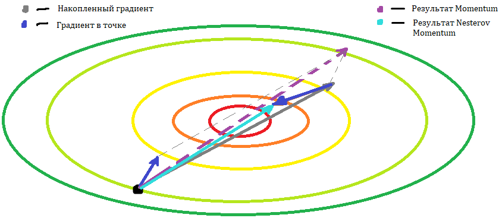
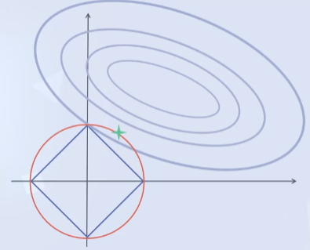
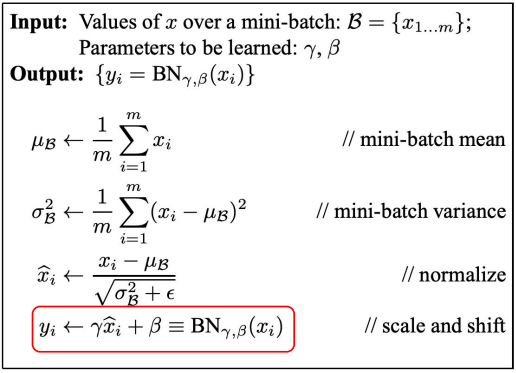
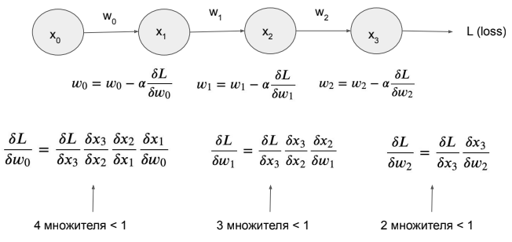
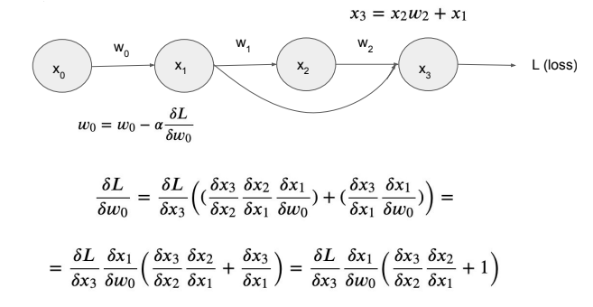
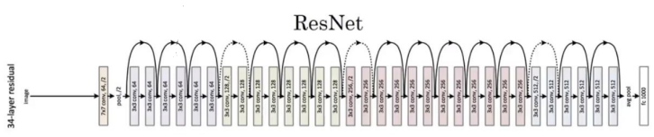

# 1ый месяц

### Предисловие
Решил сегодня _(03.01.2021)_ начать писать дневник. Буду выражать здесь свои мысли, успехи за день.
И для тренировки скоропечатания неплохо и для структуризации мыслей тоже. 
Это уже, наверное, третья моя попытка начать и систематически продолжать нечто подобное.
Ну чтож, надеюсь в этот раз мне будет не лень и будет время. Чтож в добрый путь!

## 03.01.2022

---
Сегодня снова вернулся к заброшенному курсу по ML от МФТИ. Пока вспоминал все что,
забыл и пытался реализовать predict и accuracy средствами PyTorch.
Также понял как работать с DataLoader: это по сути утилита, которая может делить 
переданный ей датасет на батчи. 

## 05.01.2022

---
Разобрался что такое тензоры в Pytorch. До этого просто принимал их как данное. Оказывается это тот
же Numpy array, но только в отличие от него может вычисляться на видеокарте. Также почитал инфу 
про автоматическое вычисление градиентов ([Autograd](https://www.youtube.com/watch?v=MswxJw-8PvE&ab_channel=ElliotWaite)).
Pytorch в отличие от остальных фреймворков, вычисляет их динамически. Т.е. граф вычислений
строиться прямо во время вычисления. Это позволяет с помощью правила нахождения производных 
сложных функций ("Правило цепочек") вычислять производные, а соответственно градиенты. 
Вызывается это с помощью метода backward() к функции которую надо оптимизировать.
Например, в NN это будет функция потерь - loss. Пусть это будет MSE = ((y-yb)**2).mean(). 
Тогда, чтобы найти градиент, нужно просто вызвать loss.backward(). 

Понял для чего нужен метод forward при создании своей нейронной сети. При создании класса NN
нужно наследоваться от базового класса nn.Module. Там при инициализации задается архитектура, и 
чтобы задать принципы перемещения данных по ней, реализуется метод forward(input). 
Там буквально описывается процесс перехода данных из одного слоя в другой. Например, результатом
работы метода на задаче классификации будет распределение вероятностей по классам. 
Этот метод вызывается при передаче значений нашей нейронной сети.
```python
net_out = net(data) # <- вот тут вызывается метод forward
loss = criterion(net_out, target)
```

## 06.01.2022

---
Наконец получилось установить CUDA и PyTorch ее [увидел](https://pytorch.org/get-started/locally/). 
Также пытался запустить вычисления на GPU, но я так и не понял получилось ли. Видеокарточка 
была загружена всего на 2% в то время как процессор на 7%. Возможно это так получается из-за
того, что я считаю градиенты по малым батчам, а не сую целый датасет в память.
Надо будет это проверить.

## 07.01.2022

---
Все таки я все правильно подключил и все вычислялось на GPU. Как я понял, из-за того, что модель
была само по себе простая, то и видеокарта почти не нагружалась. Но то что она работала можно было
судить по энергопотреблению в диспетчере задач. Это дополнительно подтвердилось когда я реализовал
LeNet и загрузка видеокарты достигала в среднем 13%. И да, я НАКОНЕЦ-ТО доделал это несчастное 
задание по сверточным нейронным сетям.

## 08.01.2022

---
Для меня стало открытием вся логика работы _Обратного распростарненния ошибки_. До этого я идейно 
понимал как оно работает с производными и понимал пример на одном нейроне, но не задумывался, а
как это все работает в обычных многослойных сетях. В общем идея работы следующая (разберем на 
многоклассовой классификации):

1. Пусть у нас подается на сеть 10 признаков, а на выходе будет **список** вероятностей отнесения к 5 классам
2. Тогда чтобы посчитать градиенты, нужно оптимизировать функцию потерь. Так как до этого я считал,
что это просто разность между правильный ответом и ответом сети, то тогда это была бы какая-то такая
функция: L = y - max(y1, y2, y3, y4, y5). Но max - недифференцируемая функция. 
3. Эта функция работала бы в задаче регрессии (например, предсказания следующего значения последовательности),
так как там на выходе есть только одно значение! 
4. Поэтому в задаче многоклассовой классификации используют Логистическую регрессию:  
   
    > $Cost(h_\theta(x), y) = -y log(h_\theta(x)) - (1 - y)log(h_\theta(x))$ - пример для двух классов, которая возвращает число - на сколько сеть далеко от правильного ответа!

5. Но это еще не все. Так как ответ нейронной сети (для конкретики пусть это будет y1)
это какая-то сложная функция: сумма произведения выходов предыдущего слоя и соответствующих весов,
то получается что функция потерь - это такая матрешка из сложных функций:

    > y1 = sum(z1*w1 + z2*w2 + ... + zn*wn),  
    > где n - кол-во нейронов на предыдущем слое, zi - ответ i нейрона, wi - вес на i нейроне;  
    > в свою очередь z1 (как и остальные z) - тоже сложная функция = sum(zz1*ww1 + zz2*ww2 + ... + zzk*wwk),  
    > где k - кол-во нейронов на предыдущем слое, zzi - ответ i нейрона, wwi - вес на i нейроне;
    > и так далее...

6. И так вычисляя градиенты и все глубже спускаясь по функции, можно дойти до входных значений,
а значит в итоге найти градиент функции потерь по ВСЕМ весам на каждом слое нейронной сети.

## 12.01.2022

---
Сделал первое подступление к пониманию работы популярных оптимизаторов. 
Все они основаны на работе *Стохастического градиентного спуска* (SGD) и каждый по своему исправляет его недостатки.  

Основные недостатки SGD:
1. "Застревание" в локальных минимумах
2. Неустойчивая оптимизация (т.е. путь оптимизации будет шумным)
3. Константный learning rate (lr). Т.е. на каких-то параметрах модели градиент скачет туда-сюда (lr большой), а в других он слишком мало изменяет параметры (lr мал) из-за чего схождения ждать нужно долго.  

*Пример оптимизации SGD*  
  

### Momentum и Nesterov momentum
Здесь предложили идею, которая убирает сразу две проблемы - 1 и 2: **Добавить инерцию к изменению градиента**. Этот метод с накоплением импульса до очевидности прост: "Если мы некоторое время движемся в определённом направлении, то, вероятно, нам следует туда двигаться некоторое время и в будущем". Это позволяет как бы на скорости "пролетать" маленькие локальные минимумы и сглаживать процесс обучения (путь). В лекции сравнивали оптимизацию с броском шарика с неровной горки.



Принцип работы такой: копим градиенты в переменной-скорости $v$ и изменяем параметры с помощью этой переменной умноженной на lr.  

Nesterov же отличается тем, что обычный momentum по инерции заносит слишком далеко и ему нужно время что бы вернуться обратно, а Nesterov это немного конпенсирует. Чем-то процесс работы обычного momentum похож на то, когда выставляешь большой lr. Причина такому поведению - большие градиенты, и при вычислении нового градиента в точке, если он мал, то почти не повлияет на изменение накопленного градиента. Поэтому Nesterov предлагает вычислять градиент уже в следующей точке.



### Adagrad и RMSProp
Для решения задачи неравномерного lr, Adagrad предлагает для каждого параметра модели хранить сумму квадратов его изменений и смотреть по ним, если она большая, значит параметр дергает туда-сюда, а следовательно lr - большой. Такая же логика будет наоборот при маленьких значениях. Для достижения адаптивного lr нужно отнормировать градиент каждого параметра с помощью суммы квадратов градиентов в переменной-кэше ***cache***.  

> $cache_{t+1} = cache_t + (\nabla f(x_t))^2$  
> $x_{t+1} = x_t - \alpha \frac{\nabla f(x_t)}{cache_{t+1} + \varepsilon}$

RMSProp дополняет Adagrad, вводя, так называемое *экспоненциальное сглаживание*. Так как квадрат - функция неотрицательная, то поэтому cache постоянно растет и из-за этого обучение будет все сильнее замедляться со временем. Для исправления этого нужно хранить кэш только нескольких последних градиентов. Этого можно достичь, уменьшая cache на каждой итерации на значение $\beta \in \{0, 1\}$, что в итоге будет все сильнее уменьшать общий вклад более старых градиентов. 

> $cache_{t+1} = \beta cache_t + (1 - \beta)(\nabla f(x_t))^2$  
> $x_{t+1} = x_t - \alpha \frac{\nabla f(x_t)}{cache_{t+1} + \varepsilon}$  

Примечание: $\varepsilon$ нужен для того, чтобы не произошло деление на ноль, т.к cache - неотрицательный.

### Итог
Каждый из недостатков был отдельно исправлен разобранными выше оптимизаторами. И как можно заметить эти исправления никак не конфликтуют между собой, а поэтому их можно совместить и получить что-то близкое к оптимизатору Adam. Но про него я пока не читал. Поэтому на сим и закончу. To be continued...

## 23.01.22

---
Только что разобрался зачем по итогу нужна кросс валидация на k-фолдах. До этого я ее использовал только в связке с GridSearch и только как процесс для подбора "оптимальных" гиперпараметров. Но и то не совсем правильно (оптимальные параметры, которые дает кросс валидация не обязательно будут оптимальными для данной задачи. Пример можно видеть в след. статье Хабра).

Кросс-валидация используется для того чтобы **оценить** (для непосредственного обучения модели ее не используют) на сколько модель хорошо обучается на данных независимо от их разбиения на тестовую и обучающую выборки. Обычно это используют чтобы сравнивать модели с разными гиперпараметрами между собой. Например будет ли улучшение если увеличить кол-во деревьев или уменьшить lr алгоритма. Реальный пример можно посмотреть [тут](https://habr.com/ru/company/ods/blog/336168/) 

Типо пусть "Модель 1" даст качество на 5 фолдах cv что-то вроде этого:  
[0.37630003, 0.43968909, 0.5886552 , 0.54800137, 0.55752035];  
А "Модель 2" что-то такое:  
[0.6630003, 0.47968909, 0.4757552 , 0.84807737, 0.2355203];  
Таким образом можно видеть как изменение одних параметров влияет на точность модели в целом.

Также понял что такое и чем отличается validation и testing выборки. Validation нужна, так сказать, для отладки процесса обучения, а testing для оценки качества модели.

Датасет делится на три **независимые** части - тренировочная, тестовая и валидационная. На *тренировочной* модель обучается, на *валидационной* проверяется ее качество прямо во время обучения (т.е можно построить два графика функции потерь - рез-тат на тренировочном и рез-тат на валидационном датасетах, а значит можно следить за тем когда модель начнет переобучаться), а на *тестовой* проверяется качество работы модели на метриках. Хочу заметить, что валидационная выборка не меняет параметры модели, а только **проверяет** обобщающее качество модели. Т.е validation работает схожим образом с testing, но служит для других целей.

Хотя опять же можно обойтись и вовсе без валидационной выборки, но тогда нельзя будет следить за переобучением модели.

Так с теорией закончил перейду к научке. В результате поисков нашел, что лучше всего себя в задаче классификации показала VGGFace. Facenet впринципе мало отставала, но все таки была чуть хуже. [Статья](https://www.ijstr.org/final-print/oct2020/A-Comparative-Analysis-Of-Face-Recognition-Models-On-Masked-Faces.pdf)

## 24.01.22

---
Сегодня разбирался с регуляризацией. В который раз вспомнил различия и пользу от l1 l2 регуляризации. В общем, эти оба метода накладывают ограничения на веса модели, заставляя ее искать как можно более маленькие значения, что в итоге позволяет сделать ML алгоритм более устойчивым. *Большие веса -> большая чувствительность к данным.*   
L2: $loss + \alpha (w)^2$  
L1: $loss + \alpha |w|$

Если L2 делает ограничения на значения весов еще более жесткими, то L1 позволяет занулять ненужные данные. (Чисто технически они оба могут занулять веса, но L1 это делает с намного большей вероятностью) Геометрически это можно показать так: L1 представляет собой ромб и с большей вероятностью оптимальное значение будет найдено в одном из его углов. L2 напротив же представляет собой окружность и обычно решение находится вне пересечения осей и графика (т.е. веса не будут занулены, но могут быть очень близкими к нулю). [Источник](https://www.coursera.org/lecture/machine-learning-foundations/pochiemu-l1-rieghuliarizatsiia-otbiraiet-priznaki-QgY9a)



Далее разобрался с batch-norm. Главная идея такая: т.к. данные для линейных моделей стоит нормировать, то значит стоит это делать не только для входа нейронной сети, но и внутри скрытых слоев (нейроны ведь тоже содержат линейную функцию). До этого проблема была в том, что при обновлении весов слоя, более глубокий (уже с обновленными весами) был обновлен с использованием предыдущей версии весов. А значит появлялся конфликт между слоями. (каждый следующий слой "опаздывал" на одно обновление признакового описания)

Принцип работы прост: 

1. Посчитать мат ожидание и дисперсию на батче 
2. Отнормировать признаковое описание
3. Scale and shift - возможно до нормирования смещение имело какой-то смысл, поэтому позволяем модели самой понять нужна ей эта информация или нет, добавляя доп параметры $\gamma$ - растяжение и $\beta$ - смещение.



В случае выпуска в продакшн нужно запомнить среднее мат ожидание и среднюю дисперсию на всем тренировочном датасете.


## 26.01.22

---
Ужс просто сколько похожих на друг друга методов в МО. Например, lr decay и adaptive lr, weight decay и L2-reg - это все разные вещи хотя принцип работы одинаков.

***Weight decay*** - это метод регуляризации, который добавляет к loss-функции константу, практически как в l2-регуляризации, для ограничения размера весов.

```python 
    # determine weight delta using back-propagation
    wt = wt + wt_delta  # update with grad
    wt = wt * 0.98      # or wt = wt - (0.02 * wt)
```

Как можно видеть, веса после обновления дополнительно уменьшаются на константу.

Также бывает сам l2-reg называют weight decay, так как если расписать формулу с помощью дифференциалов, то получиться:

> $Loss = MSE(y_{hat}, y) + wd * sum(w^2)$; **(wd - weight decay)**  
> $w(t) = w(t-1) - lr * (dMSE / dw + d(wd * w^2) / dw)$, где  
> $d(wd * w^2) / dw = 2 * wd * w$  

Можно видеть, что по формуле обновления весов (2ая формула), от веса отнимается не только градиент, но и 2 * wd * w. А значит, что веса с каждой итерацией обучения будут уменьшаться, отсюда и weight decay.

*Источники*: [1](https://jamesmccaffrey.wordpress.com/2019/05/09/the-difference-between-neural-network-l2-regularization-and-weight-decay/), [2](https://towardsdatascience.com/this-thing-called-weight-decay-a7cd4bcfccab)

Значит WD отличается от L2 тем, что первый уменьшает веса модели на какое-то константное значение, а второй на свое значение, зависящее от размера весов. Но как можно видеть, служат они одной цели - быть ограничением на размер весов.

Теперь про другие два понятия:

***Lr decay*** - методы уменьшение lr во время обучения. Вот несколько распространненых методов: 
* Time-Based Decay
* Step Decay
* Exponential Decay

Про каждый писать не буду, но скажу только, что все они уменьшают lr в какое-то константное число раз. Подробнее [здесь](https://towardsdatascience.com/learning-rate-schedules-and-adaptive-learning-rate-methods-for-deep-learning-2c8f433990d1).

***Adaptive lr*** - это методы изменения lr для каждого параметра модели в отдельности, смотря на сколько сильно они изменяются (например Adagrad, Adadelta, RMSprop, Adam). 
В отличие от *lr decay* эти алгоритмы изменяют lr в зависимости от нужды (большой lr - при медленном изменении, маленький lr при большом). Про них подробно писал ранее (12.01.22).

Но в заключение, хочется сказать что lr decay и adaptive lr хоть и реализованы по разному, но опять же служат одной цели - изменчивому lr и более гладкому обучению (уменьшению шумов).

## 28.01.22

---
Некоторые полезные заметки:
1. Batch norm обычно не ставят перед последним слоем сети, т.к. модель на этом слое делает предсказания, а регуляризация смещает ответ.
2. Dropout не ставят перед Batch norm, т.к. первый убирает рандомно n-ое кол-во нейронов, а следовательно каждый раз меняет мат. ожидание и дисперсию, чем мешает Batch norm правильно отнормировать выходы.

Также разобрался как работает свертка на нескольких картах. Опять же в лекциях приводили примеры только для одной карты активации. В общем, принцип такой: 
каждая новая ячейка новой карты высчитывается с помощью ядра на всех пришедших картах. [Вот](https://www.youtube.com/watch?v=f0t-OCG79-U&ab_channel=IsraelVicars) видео иллюстрация.

## 29.01.22

---
Затухание градиента. Пусть все дифференциалы будут по модулю меньше 1 (На практике обычно так и есть). Тогда по правилу вычисления сложных функций они будут перемножаться, а так как вычисление градиента идет от более глубоких слоев к более ранним, то следовательно при движении к началу сети дифференциалы будут становиться все ближе и ближе к нулю. Это означает, что в глубоких сетях более ранние слои практически не будут изменяться, а значит сеть практически не будет обучаться.



Решают эту проблему с помощью Skip connection. Skip connection - это соединение без веса, которое идет от одного слоя через **несколько** слоев сети к другому. 
С математической точки зрения, здесь в месте соединения слоя и skip connection'а происходит суммирование пришедших значений, а значит и суммирование дифференциалов. Далее см. рис.



Из-за того что один из множителей стал больше 1 градиент не будет затухать (имеется в виду данная область сети), а значит сеть сможет обучаться. 

Также SC обладает еще некоторыми полезными свойствами:
1. Помогает проталкивать информацию из более ранних слоев, а значит помогает получать более полную информацию (ранние слои дают более низкоуровневую инфу, в отличие от последуюших)
2. Является дополнительными путями для информации. Это означает, что если выкинуть некоторые слои из сети, то информация все равно сможет пройти по этим обходным путям.

ResNet - CNN + Skip Connection.


Кстати пришла на ум аналогия сравнивать свертку с увеличением масштаба. Типо на первых слоях мы видим только отдельные пиксели, линии. Далее на более глубоких слоях масштаб увеличился и можно различать отдельные геометрические фигуры и т.д.
